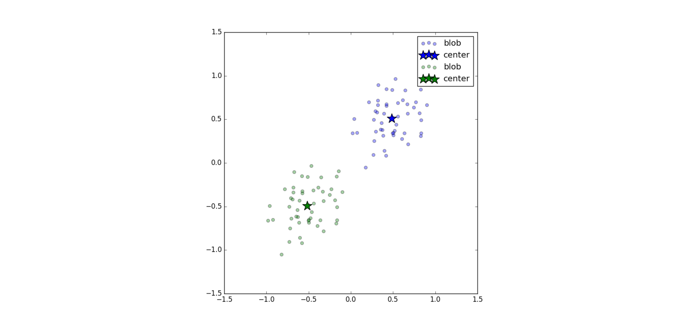

# An Introduction to Performant Python

## Preamble

This repository aims to serve as an introduction to discovering numeric performance optimizations in the Python programming language; it assumes only a cursory knowledge of Python and a tolerance for pinches of math.

Python is well known to be an incredible learning language for beginning programmers on account of its readability, intuitive syntax, and wonderful community.

What many people don't know about Python when they unknowingly choose it from a stack of languages based on what programming language the internet suggests a beginner start with is that Python has a vast array (no pun intended) of other amazing features, libraries, and applications; many more in fact than a beginner could even begin to guess.

A short, but far from exhaustive, list of fantastic Python offerings to whet your technical palate:
* [Django](https://www.djangoproject.com/) - web development.
* [Selenium-Python](http://selenium-python.readthedocs.io/) - web browser automation.
* [SciPy](https://www.scipy.org/) - scientific computing.
* [Scikit-Learn](http://scikit-learn.org/stable/) - machine learning.
* [Tensorflow](https://www.tensorflow.org/) - nuff said.

It is through a specific library within the SciPy ecosystem that this repository will introduce programming performant Python. That library is [NumPy](http://www.numpy.org/).

## NumPy 

NumPy's front page defines itself as the following:

> NumPy is the fundamental package for scientific computing with Python. It contains among other things:
> * a powerful N-dimensional array object
> * sophisticated (broadcasting) functions
> * tools for integrating C/C++ and Fortran code
> * useful linear algebra, Fourier transform, and random number capabilities

These are amazing features indeed if we're looking for a library to add some performance to our Python code.

As this repository intends simply to introduce NumPy we will be focusing on the first two bullet points, N-dimensional arrays and broadcasting functions. To do so without waxing poetic or getting incredibly abstract, bordering esoteric, let us introduce an example problem.

## k-means

[k-means](https://en.wikipedia.org/wiki/K-means_clustering) is an unsupervised machine learning algorithm designed to discover clusters within a dataset. Consider the following, highly math-less description, of k-means:

    Try to find the centers of blobs of that already "exist" within a dataset.

The following image, hopefully in the more intuitive visual way, demonstrates what is meant by "centers" and "blobs".



In order to stay on the rails and keep chugging towards learning about injecting performance into Python and not detour deep into machine learning algorithms...ville, let's take a look at an implementation of k-means using only built-in python functions and data types.

**Note:** The code blocks throughout the remainder of this tutorial will not include doc strings to cut down on unnecessary space usage. In addition, code blocks will be accompanied by descriptions of the code. Also! Doc strings are important, and are included in the actual scripts.

This k-means implementation lives under the name `base_python` in the `kmeans.py` script. The meat of it however is implemented in two functions: `get_new_assignments` and `calcualte_new_centroids`. Let's look at both now.

### Getting New Centroid Assignments
```python
def get_new_assignments(centroids, X):
    centroid_assignments = [[] for _ in centroids]
    for x in X:
        closest_dist = 1e100
        closest_centroid = None
        for centroid_idx, centroid_location in enumerate(centroids):
            current_dist = list_euclidean_dist(centroid_location, x)
            if current_dist < closest_dist:
                closest_dist = current_dist
                closest_centroid = centroid_idx
        centroid_assignments[closest_centroid].append(x)
    return centroid_assignments
```
